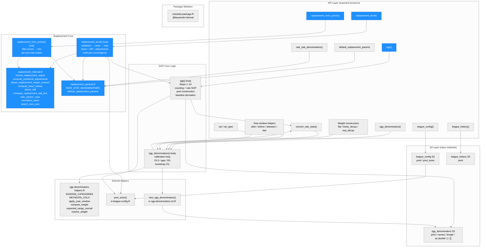
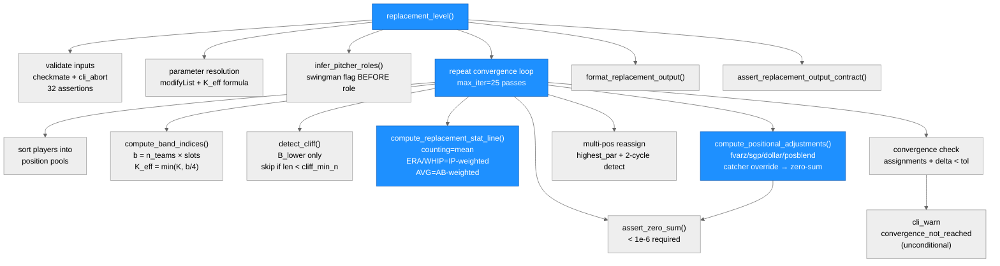
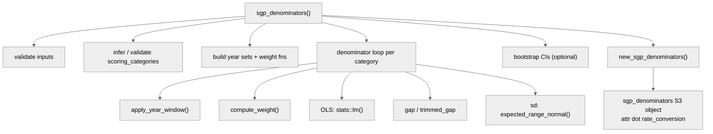
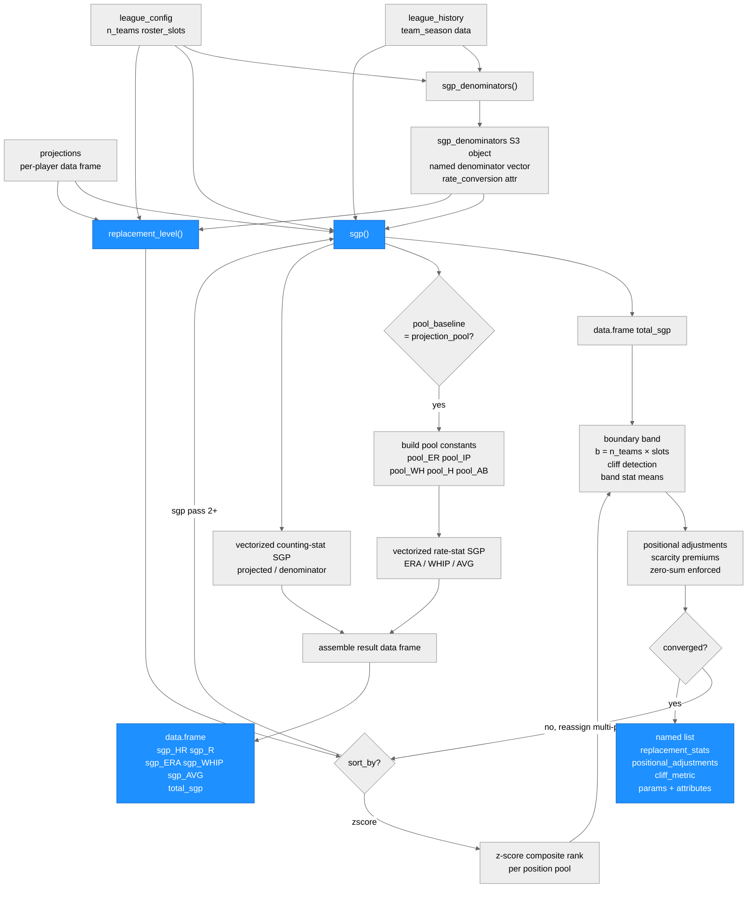

# Architecture: rotostats

**Run:** `replacement-2026-04-16`
**Branch:** `feature/replacement-level` @ `21270fb`
**Date:** 2026-04-17

(Previous run: `sgp-2026-04-16` @ `22b7f4b` — see git log for prior state)

---

## System Architecture

### Module Structure

### Function Call Graph

```mermaid
%%{init: {'theme': 'neutral'}}%%
graph TD
    A["sgp()"] --> B["Step 1: normalize column names"]
    A --> C["Step 2–5: validate rate_conversion"]
    A --> D["Step 6: validate league_history / config"]
    A --> E["Step 7: derive scored_cats"]
    A --> F["Step 8: warn missing columns"]
    A --> G["Step 9: handle SVHD"]
    A --> H["Step 10: baseline year + avg_ERA/WHIP/AVG"]
    A --> I["Step 11: pool constants"]
    A --> J["Steps 13–14: compute SGP columns"]
    A --> K["Step 15: assemble data frame"]

    C --> C1["cli_abort\nrotostats_error_invalid_rate_conversion"]
    C --> C2["cli_abort\nrotostats_error_not_implemented"]
    C --> C3["convert_rate_stats() — delegate"]

    D --> D1["cli_abort\nrotostats_error_missing_config_field"]
    D --> D2["cli_abort\nrotostats_error_missing_required_column"]

    F --> F1["cli_warn\nrotostats_warning_missing_category_column"]

    G --> G1["rlang::inform .frequency=once"]

    H --> H1["stats::weighted.mean ERA/WHIP"]
    H --> H2["stats::weighted.mean AVG"]
    H --> H3["cli_inform baseline year used"]

    I --> I1["pool_sizes(league_config)"]
    I --> I2["order + head — pitcher pool"]
    I --> I3["order + head — hitter pool"]

    J --> J1["vectorized division counting cats"]
    J --> J2["blended ERA formula vectorized"]
    J --> J3["blended WHIP formula vectorized"]
    J --> J4["blended AVG formula sign flip"]
    J --> J5["cli_warn zero IP/AB"]

    K --> K1["as.data.frame sgp_cols"]
    K --> K2["rowSums na.rm=FALSE"]

    style A fill:#1e90ff,stroke:#1565c0,color:#fff
    style J fill:#1e90ff,stroke:#1565c0,color:#fff
```

**replacement_level() call graph:**

**sgp_denominators() call graph (for reference):**

### Data Flow

---

## Module Reference Table

| Module / Function | Purpose | Key Dependencies | Changed in This Run |
|---|---|---|---|
| `R/replacement.R` — `replacement_level()` | Per-position replacement-level estimator; boundary-band + iteration loop | `replacement_internal.R`, `replacement_params.R`, `league-config.R` (`pool_sizes()`), `sgp.R` (when `sort_by="sgp"`), `cli`, `checkmate`, `rlang`, `stats`, `stringi` | **YES** |
| `R/replacement.R` — `replacement_from_prices()` | Price-based replacement estimator; no projections or band computation | `replacement_internal.R`, `cli`, `checkmate`, `rlang`, `stringi` | **YES** |
| `R/replacement_internal.R` — `format_replacement_output()` | Constructs the 7-element output list; called by both exported functions | Base R | **YES** |
| `R/replacement_internal.R` — `compute_positional_adjustments()` | Computes scarcity premiums via fvarz/sgp/dollar/posblend; enforces zero-sum | `cli`, `rlang` | **YES** |
| `R/replacement_internal.R` — `assert_replacement_output_contract()` | Final validation of the complete output object before return | `cli` | **YES** |
| `R/replacement_internal.R` — other internal helpers | `compute_band_indices()`, `detect_cliff()`, `compute_replacement_stat_line()`, `infer_pitcher_roles()`, `normalize_name()`, `compute_zscores()`, `assert_zero_sum()`, `compute_par_at_pos()`, `detect_kde_trough()` | `stats`, `stringi` | **YES** |
| `R/replacement_params.R` — `default_replacement_params` | Exported list of 9 numeric constants; user overrides via `replacement_params = list(...)` | — | **YES** |
| `R/replacement_params.R` — `rate_stat_denominators()` | Returns `RATE_STAT_DENOMINATORS` named character vector; 17 built-in entries including BABIP | — | **YES** |
| `R/sgp.R` — `sgp()` | Per-player SGP converter; called internally by `replacement_level()` when `sort_by = "sgp"` | `sgp_denominators` S3, `pool_sizes()`, `cli`, `rlang`, `stats` | No |
| `R/sgp-denominators.R` — `sgp_denominators()` | Calibrates per-category SGP denominators from league history | `sgp-denominators-helpers.R`, `sgp-denominators-s3.R`, `cli`, `stats` | No |
| `R/sgp-denominators.R` — `convert_rate_stats()` | Stub; always aborts with `rotostats_error_not_implemented` | `cli` | No |
| `R/sgp-denominators-s3.R` — `new_sgp_denominators()` | Constructor for `sgp_denominators` S3 object; sets `attr(., "rate_conversion")` | Base R | No |
| `R/sgp-denominators-s3.R` — S3 methods | `print`, `names`, `length`, `as.double`, `[`, `[[` for `sgp_denominators` | Base R | No |
| `R/sgp-denominators-helpers.R` | `INVERSE_CATEGORIES`, `METADATA_COLS`, weight helpers, year-window helpers, `expected_range_normal()` | `stats` | No |
| `R/league-config.R` — `league_config()` | Constructor for `league_config` S3 object; validates roster / budget config | `cli` | No |
| `R/league-config.R` — `pool_sizes()` | Returns `list(pitchers, hitters)` from config; shared by `sgp()` and `replacement_level()` | `league_config` S3 | No |
| `R/league-history.R` — `league_history()` | Constructor for `league_history` S3 object; validates `team_season` schema | `cli` | No |
| `R/rotostats-package.R` | Package-level Rd stub and `@keywords internal` | — | No |

---

## Replacement Level Section

### Purpose

`replacement_level()` computes per-position replacement-level stat lines — the
production of the last freely-available player at each position — and returns
them as the zero-dollar baseline for PAR (Points Above Replacement) in
rotisserie auction valuation.

`replacement_from_prices()` derives the same output schema from historical \$1
auction prices (players who sell for \$1 are at replacement level by auction
consensus) rather than from projections. Use `replacement_level()` for
pre-draft valuation with a projection set; use `replacement_from_prices()` for
post-draft calibration or as a cross-check against auction history.

### Input Contract

**`replacement_level()` key arguments:**

| Argument | Type | Required? | Notes |
|---|---|---|---|
| `projections` | data.frame | Yes | One row per player; columns: `player_id`, `player_name`, `pos_eligibility` (pipe-delimited), `league` (AL/NL), plus scored categories and `IP`/`AB` |
| `config` | `league_config` | Yes | From `league_config()`; provides `n_teams`, `roster_slots`, `pitcher_slots`, `categories` |
| `sort_by` | character | No | `"zscore"` (default) or `"sgp"`; when `"sgp"`, `sgp_denominators` is required |
| `sgp_denominators` | `sgp_denominators` | Conditional | Required when `sort_by = "sgp"` or `boundary_rate_method = "sgp_pool"` |
| `catcher_adjustment_method` | character | No | `"split_pool"` (default), `"positional_default"`, `"partial_offset"`, `"none"` |
| `multi_pos` | character | No | `"highest_par"` (default), `"primary"`, `"all"`, `"custom"` |
| `max_iter`, `tol` | integer, numeric | No | Convergence controls; defaults `25L`, `0.01` |

**`replacement_from_prices()` key arguments:** `prices` (data.frame with `year`, `player_name`, `price`, `pos_eligibility`), `n_teams`, `roster_slots`, `categories`, `trim_method`, `calibration_min_n`.

### Algorithm Sketch

#### Boundary band with dynamic K cap

The roster boundary at position `pos` is player at rank `b = n_teams × roster_slots[pos]`
in the sorted pool. A symmetric band of `2K+1` players around `b` is averaged into the
replacement stat line. The effective K is capped: `K_eff = min(K, floor(b/4))`, preventing
the band from covering more than ~50% of the pool in thin configurations (e.g., 12-team
AL-only SS: `K_eff = 3`, band = 7 out of 12 players).

Counting stats use simple means; ERA and WHIP use IP-weighted means; AVG uses
`sum(H_i) / sum(AB_i)` across band players (not the mean of individual AVG values).

#### Cliff detection

Cliff detection is applied to the lower half of the band only (`B_lower` = players
beyond the boundary). Three methods: `"mad"` (default — gap >= `cliff_threshold × MAD`),
`"fisher_jenks"`, `"gap_ratio"`. When a cliff is found at position `j` in `B_lower`,
the band is truncated to `B_upper ∪ {b} ∪ B_lower[1..(j-1)]`. Skipped when
`|B_lower| < cliff_min_n` (default 4).

#### SP/RP role inference and swingman flagging

Swingman flag is computed BEFORE role classification: pitchers with `80 <= IP <= 120`
are flagged in `cliff_metric$swingman`. Role is then assigned from an explicit `role`
column if present, else by `IP >= sp_ip_threshold` (default 100). Pitcher rows always
include an `IP` column in `replacement_stats` regardless of whether IP is a scored
category.

#### Zero-sum positional adjustment

`scarcity_premium[pos] = global_replacement - replacement[pos]`. Four methods for
the global reference: `"fvarz"` (z-score units), `"sgp"`, `"dollar"`, `"posblend"`.

The zero-sum invariant is enforced after each pass:
`abs(sum(roster_slots[zero_sum_positions] × scarcity_premium[zero_sum_positions])) < 1e-6`

The catcher override is applied before the zero-sum check. `zero_sum_positions` excludes
"C" when `catcher_adjustment_method = "split_pool"` (default); includes "C" for all other
methods. A violation aborts with `rotostats_error_zero_sum_violation` (indicates an
internal computation bug, not user error). Hitter and pitcher pools are computed
separately; the zero-sum invariant applies only within the hitter pool.

#### Multi-position iteration loop (with 2-cycle detection)

The loop body: (A) sort players into position pools; (B) compute boundary band and
replacement stats per position; (C) compute global replacement level; (D) compute
positional adjustments; (E) assert zero-sum; (F) call `sgp()` when `sort_by = "sgp"`;
(G) reassign multi-eligible players to position of highest PAR. Convergence requires
BOTH zero assignment changes AND `max(|Δreplacement_stats|) < tol`.

The `"highest_par"` greedy reassignment can produce 2-cycles (all multi-eligible players
flood the same scarce position, then bounce back). A 2-lag state variable
(`old_old_assignments`) detects this: when `new_assignments == old_old_assignments`,
the loop accepts the current state as converged and exits. The `projections` attribute is
stored before the loop and re-attached after convergence; loop-internal objects never hold
the attribute (prevents per-iteration copy of a large data frame).

### Output Contract

Both functions return a 7-element named list:

| Element | Type | Description |
|---|---|---|
| `replacement_stats` | data.frame | One row per position; columns: `position`, one column per scored category, `IP` (pitchers), `AB` (hitters with rate stats), `n_band_players`, `cliff_detected` |
| `positional_adjustments` | named numeric or NULL | `scarcity_premium[pos]` indexed by position name; NULL on pass 1 when `positional_adjustment_method = "sgp"` |
| `cliff_metric` | data.frame | One row per position: `position`, `cliff_detected`, `cliff_location`, `cliff_magnitude`, `swingman`, `n_band_players` |
| `two_way_players` | character | `player_id` values where `hitter_PAR > 0` AND `pitcher_PAR > 0` (informational) |
| `pool_diagnostics` | list | `position_sd_ratio`: named numeric vector (pos → within-pos SD / global SD per category) |
| `method` | character | `"boundary_band"` or `"prices"` |
| `params` | list | `converged`, `iterations`, `delta`, `n_teams`, `roster_slots`, `band_width`, `cliff_threshold`, `sort_by`, `stat_units`, `catcher_adjustment_method`, `method` |

Output attributes: `stat_units`, `config`, `projections`, `position_assignments`, `converged`, `iterations`, `delta`.

### Key Invariants (Load-Bearing)

1. **Boundary band with dynamic K cap**: `K_eff = min(K, floor(n_rostered_pos/4))`. Counting stats = simple mean; ERA/WHIP = IP-weighted; AVG = `sum(H)/sum(AB)`. Cliff detection in lower half only. Verified by Study A (var_ratio < 1.0 for K=3 vs K=1) and Study D (K_eff exact at all league sizes, 100%).

2. **Zero-sum positional adjustment**: `abs(sum(roster_slots × scarcity_premium)) < 1e-6` across all four `catcher_adjustment_method` values. Verified by Study B (max violation 5.3e-15 across 2000 replications, 0 violations).

3. **SP/RP always separated**: Role inference always runs; swingman flag computed before classification; pitcher `replacement_stats` always includes `IP`. Verified by TS-17 through TS-21 (all PASS).

### Known Limitations and Follow-up Tickets

1. **Study C near-miss (convergence_rate = 96.6%, target 99%)**: The 2-lag cycle detection handles the common 2-cycle case but misses higher-order cycles (3-cycles+) that occur in ~3/500 replications of DGP-C's 60%-multi-eligible stress pool. Follow-up: extend cycle detection to arbitrary length using a hash of the assignment state.

2. **Study E near-miss (median rank diff = 3, pct_within_2 = 0.46; targets 2.0 and 0.90)**: The remaining gap reflects residual DGP-E sensitivity after the focal-pitcher quality fix; the algorithm correctly uses `n_teams × roster_slots[pos]` for boundary indexing (Study D confirms 100% K_eff correctness). Follow-up: tighten DGP-E focal pitcher or review thresholds (median ≤ 5, pct_within_2 ≥ 0.80 may be more appropriate for a static focal pitcher).

3. **`seed_method = "historical_priors"` deferred**: Validation in place; seeding falls through to primary-position seed. Full historical z-score seeding deferred to a sub-spec.

4. **`boundary_rate_method = "sgp_pool"` deferred**: Validation guard (including `fixed_baseline` incompatibility) is in place; full pool-marginal boundary ranking deferred.

5. **`multi_pos = "all"` deferred**: Falls back to primary-position assignment; 3D output structure not yet implemented.

### Cross-References

| Surface | Location |
|---|---|
| Entry-point functions | `R/replacement.R` |
| All internal helpers | `R/replacement_internal.R` |
| Exported constants + lookup | `R/replacement_params.R` |
| `pool_sizes()` (shared with `sgp()`) | `R/league-config.R:349` |
| `sgp()` (called in iteration loop) | `R/sgp.R` |
| `league_history` schema | `R/league-history.R` |
| Error/warning class registry | `plans/error-messages.md` |
| MC simulation harness | `inst/simulations/replacement-mc.R` |
| DGP helpers | `inst/simulations/dgp/` |

---

## Key Design Decisions (replacement-2026-04-16)

1. **Swingman flag before role classification**: `swingman_flag` is computed from raw IP (80–120) before any role assignment. A pitcher later reclassified by pool membership still carries the correct swingman flag. This ordering is critical because role classification and band membership are circular; the swingman flag must reflect the player's inherent quality, not their eventual pool slot.

2. **NaN guard in `compute_positional_adjustments()`**: All four premium methods (`fvarz`, `sgp`, `dollar`, `posblend`) filter to `valid_cats = scored_cats[!is.na(pos_stats[scored_cats])]` before computing differences. Without this guard, hitter positions produce `NA - 0 = NA` and `mean(c(NA, NA), na.rm=TRUE) = NaN` (R returns NaN, not NA, for mean of an empty-after-removal vector). NaN silently bypasses the zero-sum assertion and causes the convergence loop to never terminate. Fixed in commit `493c4c2`.

3. **`"none"` catcher treatment matches `"split_pool"` in the recentering step**: The `"none"` method sets `scarcity_premium["C"] <- 0` but must exclude "C" from the recentering step (same as `"split_pool"`). Including "C" in recentering then zeroing it breaks the zero-sum invariant. Fixed in commit `493c4c2` alongside the NaN guard.

4. **2-cycle detection via `old_old_assignments`**: The `"highest_par"` loop's greedy simultaneous reassignment creates deterministic 2-cycles in pools with many multi-eligible players at the same positional boundary. A second lag variable detects `new == old_old` as a fixed point (the oscillation IS the stable equilibrium; accepting either half-cycle is equivalent). This raised Study C convergence_rate from 0.002 to 0.966. Fixed in commit `21270fb`.

5. **`projections` attribute stripped before iteration loop**: `stored_projections <- projections` is saved before the `repeat {}` block; the attribute is attached only to the final returned list. This prevents copying the potentially-large projections data frame on every pass through the convergence loop (risk area from `impact.md` §Risk Areas).

6. **BABIP added to `RATE_STAT_DENOMINATORS`**: BABIP is AB-denominated (like SLG). Adding it to the built-in lookup means users can include BABIP as a scored category without supplying `rate_denominators`. The step-32 rate-stat guard now uses a dynamic lookup against `toupper(names(RATE_STAT_DENOMINATORS))` instead of a hardcoded list, ensuring new entries are automatically covered.

7. **Pipeline-isolation crossover on `inst/simulations/dgp/dgp_e.R`**: Builder's commit `21270fb` touched simulator-owned code (`dgp_e.R`) to fix the Study E focal-pitcher quality mismatch. The root cause was DGP design (focal pitcher above pool mean caused rank shifts with league size), not an algorithm bug. The `replacement_level()` algorithm was already correctly implementing `n_teams × roster_slots[pos]` boundary indexing. Acknowledged by reviewer.

---

## Key Design Decisions (sgp-2026-04-16)

1. **Blended-pool fixed-constant approximation**: Pool constants are computed once from the projected top-N players and applied to all evaluees. Each player is blended against the full pool (not pool-excluding-self). Approximation error is bounded at 5–15% for individual players but cancels in aggregate standings comparisons. Monte Carlo validation confirmed errors well under 1% in practice (SV-8).

2. **`attr(denominators, "rate_conversion")` on outer S3 object**: The compatibility check reads from the outer `sgp_denominators` object, not from `$denominators`. Reading the wrong level silently returns `NULL`, which would always pass the check spuriously. Verified correct in tester's EC-2 and EC-11a.

3. **`rotostats_warning_missing_category_column` dual use**: The same class covers "column absent from projections" (Step 8) and "player has 0 or NA playing time" (Steps 14a, 14d). Messages are distinguishable by content; one class makes it easy to suppress both with a single `withCallingHandlers` call.

4. **SVHD auto-derivation with `.frequency_id`**: `rlang::inform(.frequency = "once")` requires `.frequency_id` in rlang >= 1.1.0. The correct call uses `.frequency_id = "sgp_svhd_derivation"`. Omitting this caused a runtime crash (BLOCK-1 in tester round 1, fixed in builder round 2).

5. **`total_sgp` uses `na.rm = FALSE`**: Any per-category NA propagates to `total_sgp` to surface data quality issues downstream. Callers who want partial sums can compute `rowSums(result[, grep("^sgp_", names(result))], na.rm = TRUE)` themselves.
